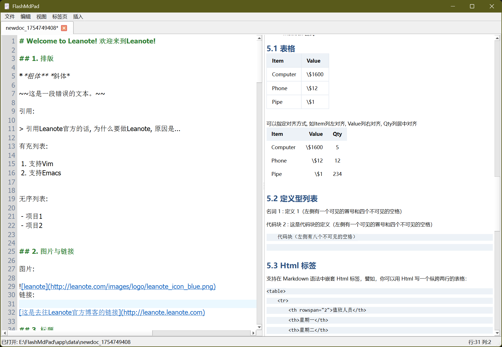

## FlashMdPad 简单快速编写Markdown文件

**简单的markdown文本编辑器， 支持简单的渲染**

### 屏幕截图



采用PySide6

**注意 文件保存在data目录下， 当前正在添加删除文件功能**

当前支持的功能

1. 支持markdown文本编辑
2. 程序关闭后收在托盘

当前markdown支持情况

1. 基础markdown语法（除图片渲染）
2. markdown表格扩展语法


待办事项
1. 图片渲染
2. 代码高亮
3. 添加自定义插入
4. 支持 ctrl+enter(command+enter) 计算表达式

可以在仓库release中下载打包好的版本， 采用Pyinstaller打包


### 构建

#### MacOS
```bash
# 安装完成依赖后， 直接执行build_for_osx.sh即可
bash build_for_osx.sh
```
### windows
```powershell
# 执行即可
pyinstaller ./FlashMdPad.spec
```